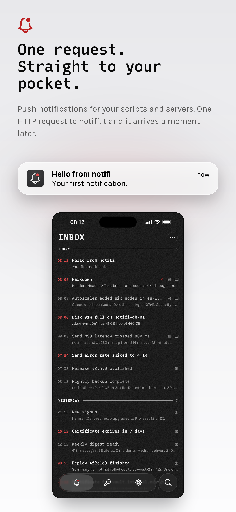
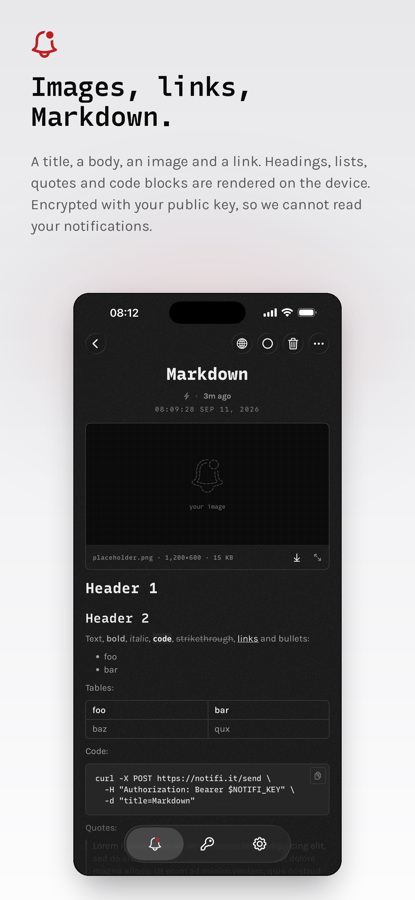

<p align="center">
  
</p>

<p align="center"><b>Push notifications for scripts, servers, apps and devices.</b></p>

One HTTP request to `notifi.it` and it’s on your iPhone or Mac.

```bash
curl "https://notifi.it/send?key=nk_…&title=hello+world"
```

No accounts. No sign-in. No device linking. The device holds the only private key,
notification content is encrypted with that key at ingest so the server cannot read it, and
each notification is deleted once the device acknowledges it. It is a relay, not a
mailbox.

The backend is a single Cloudflare Worker over a D1 database; the app is a
zero-dependency SwiftUI client for iOS 17+ and macOS 14+.

<p align="center">
  
  
</p>

## Documentation

- **[notifi API documentation](https://notifi.it/docs)**: the `/send` endpoint,
  its parameters, its error codes and its limits.
- **[llms.txt](https://notifi.it/llms.txt)**: the same thing as plain text for
  coding agents, including when to reach for notifi and how to ask a human for a
  send key.
- **[openapi.json](https://notifi.it/openapi.json)**: OpenAPI 3.1 for `/send`.
- **[Postman collection](https://notifi.it/notifi.postman_collection.json)**:
  v2.1, which Bruno, Insomnia and Hoppscotch import as well; the
  **[.bru file](https://notifi.it/notifi.bru)** is there for Bruno directly.
- **[FAQ](https://notifi.it/faq)**,
  **[privacy](https://notifi.it/privacy)**
  and **[terms](https://notifi.it/terms)**.

Every page is also served as Markdown: send `Accept: text/markdown`, or append `.md`.

## Quickstart

```bash
pnpm install
make migrate     # apply migrations to the local D1
make dev         # wrangler dev — local Worker + local D1, what Debug builds talk to
```

## Layout

```
apps/
  app/        Xcode project (iOS + macOS + two NSE targets)
  api/        Cloudflare Worker (Hono, TypeScript) — @notifi/api
packages/
  contract/   Zod schemas, the single source of truth — @notifi/contract
```

This project has **no automated tests and no code comments**; verification is
by hand.
